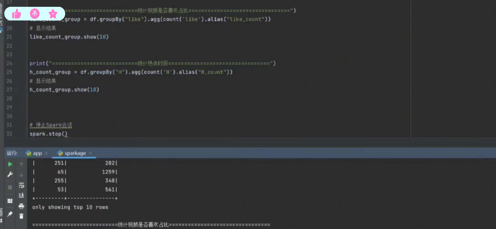

## 计算机毕业设计Hadoop+Spark抖音可视化 抖音舆情监测 预测算法 抖音爬虫 抖音大数据 情感分析 NLP 自然语言处理 Hadoop Hive

## 要求
### 源码有偿！一套(论文 PPT 源码+sql脚本+教程)

### 
### 加好友前帮忙start一下，并备注github有偿抖音可视化
### 我的QQ号是2827724252或者798059319或者 1679232425或者微信:bysj2023nb

# 

### 加qq好友说明（被部分 网友整得心力交瘁）：
    1.加好友务必按照格式备注
    2.避免浪费各自的时间！
    3.当“客服”不容易，repo 主是体面人，不爆粗，性格好，文明人。
## 介绍
基于spark大数据某音数据可视化大屏，Hadoop代做，Hadoop开发，大数据Spark项目，Hadoop项目，可视化大屏。数据挖掘，大数据分析，协同过滤算法，Java开发，scala，hadoop，hdfs，spark，hivefink，mysql，回归预测算法，贝叶斯神经网络模型，SVM算法，随机CNN，DNN，不森林，决策树。数据处理，数据仓库，数据分析。数据可视化，推荐算法。
实力：十年大厂经验，985研究生
## 演示视频
https://www.bilibili.com/video/BV1KBBYY6ELr/?spm_id_from=333.999.0.0
## 运行截图

